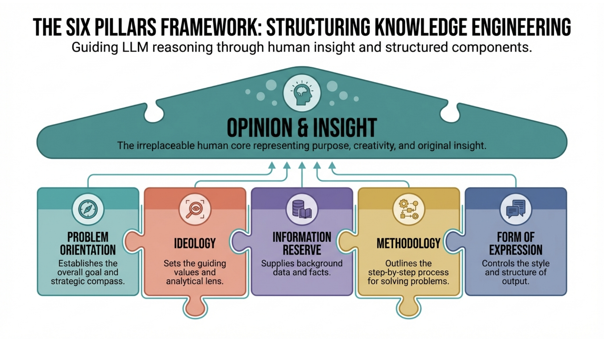

# Pillars of Knowledge Engineering

A lightweight research skill that feeds the human's Opinion & Insight.

knowledge-engineering is a skill in the [Agent Skills](https://agentskills.io/) format — a single `SKILL.md` that turns a vague ask into a confirmed question, grounds every claim in fetched sources, and delivers a structured brief with the user's judgment at the center. Released under [CC0 1.0](LICENSE) — no attribution, no restrictions.

The name is the discipline the framework's paper names: knowledge engineering — not prompt tweaking, but consciously structuring what only the human can supply while the model does the rest.


## Why

LLM agents fail at research in predictable ways: the question never gets sharpened, search snippets are trusted as sources, fetched material gets lost, facts and interpretations blur together, and a conclusion arrives without showing its work. Frontier models have the competence; what they lack is a checklist that makes the failure modes explicit and keeps the human in the loop at the right moments.

## Theoretical basis

The five-pillar structure is not an invention of this skill: it operationalizes, in lightweight form, a framework published by the skill's author:

> **Xiong Jie.** "A Pattern Language for Knowledge Engineering with Large Language Models." *PLoP 2025* (32nd Conference on Pattern Languages of Programs, People, and Practices). [DOI 10.64346/PLoP2025p02](https://doi.org/10.64346/PLoP2025p02).

The paper presents a pattern language for human–LLM collaboration built around six pillars — Problem Orientation, Ideology, Information Reserve, Methodology, Form of Expression, and Opinion & Insight, the human core at the center. This skill turns that pattern language into a one-sitting research workflow: the five supporting pillars structure the work, every pillar ends at a human decision point, and the conclusion belongs to the user.



## Install

```bash
npx skills add eXtremeProgramming-cn/knowledge-engineering
```

This installs the skill to the universal `~/.agents/skills/knowledge-engineering` location and symlinks it into the Agent Skills–compatible harnesses on your machine — Claude Code, Hermes, Cursor, Cline, Codex, and others. No build, no configuration.

Options:

- **User-wide install** (recommended): add `-g`.
- **Project-level install** (one project only): run the command inside that project directory.
- **Specific agent**: add `-a <agent>`.

Skills are discovered at session start, so start a new session after installing.

Verify with `npx skills list`; update with `npx skills update knowledge-engineering`; remove with `npx skills remove knowledge-engineering`.

## Use

With the skill installed, ask the agent to research the way you always do:

```
research how Brazil's landless workers' movement organizes food sovereignty, and write me a brief
```

The skill routes the task through its five pillars — sharpens the question with you first, fetches full texts instead of trusting snippets, keeps every source on disk, reads through the ideological framework (kritik for Marxist organizations), and delivers an executive-summary-first brief whose conclusions are labeled as the assistant's, with open questions left to you.

Even without installing, you can point an agent at the skill:

```
use knowledge-engineering (https://extremeprogramming-cn.github.io/knowledge-engineering/) for this research task
```

## Add to a workspace (CLAUDE.md / AGENTS.md)

To make the method available in every session of a research workspace, paste this section into its `CLAUDE.md` or `AGENTS.md`:

```
## Research method (knowledge-engineering)

Research tasks in this workspace follow the five-pillar method — see [github.com/eXtremeProgramming-cn/knowledge-engineering](https://github.com/eXtremeProgramming-cn/knowledge-engineering). If the skill is not installed, reference that repository and follow its `SKILL.md`.
```
